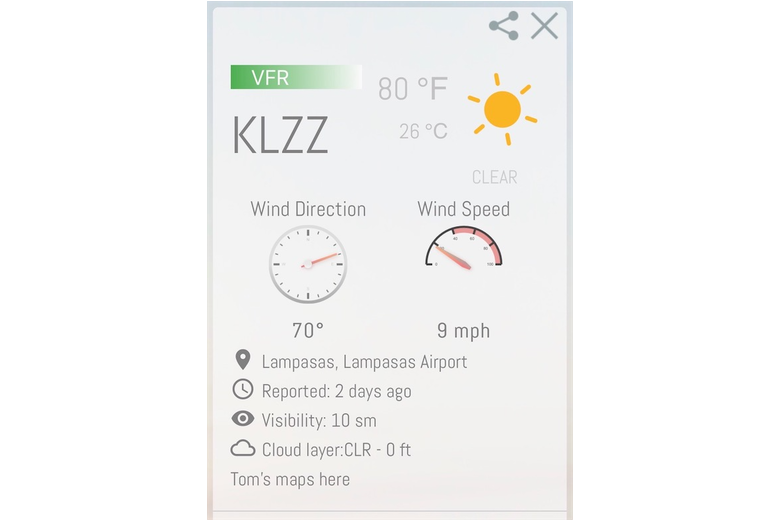

# Project Title

**Go/No-Go Weather - A Pilot's Pre-flight Weather App**

## Description:

Pre-flight weather is critical. Go/No-Go gives you all the weather information you need to make a informed "Go/No-Go" decision.

## Installing

<<<<<<< HEAD
- Clone this repository and open the index.html file in your browser of choice, that's it!

## Built With

- HTML
- CSS
- Javascript
- jQuery
- Materialize

## Instructions

- Clone this repository at https://github.com/lmasullo/go-nogo
- Open index.html in your browser
- Alternately go to https://lmasullo.github.io/go-nogo/

- Choose your Departure and Destination airports and click "Let's Go" and you will be presented with the current weeather for both airports.

## GitHub Repo

=======
* Clone this repository and open the index.html file in your browser of choice, that's it!

## Built With

* HTML
* CSS
* Javascript
* jQuery
* Materialize

## Instructions

* Clone this repository at https://github.com/lmasullo/go-nogo
* Open index.html in your browser
* Alternately go to https://lmasullo.github.io/go-nogo/

* Choose your Departure and Destination airports and click "Let's Go" and you will be presented with the current weeather for both airports.

## GitHub Repo
>>>>>>> 0f9d7e43b4953508ee9ddc19c9950ac502f4c176
https://github.com/lmasullo/go-nogo

## Versioning

<<<<<<< HEAD
We use [SemVer](http://semver.org/) for versioning.
=======
We use [SemVer](http://semver.org/) for versioning. 
>>>>>>> 0f9d7e43b4953508ee9ddc19c9950ac502f4c176
Current version is 1.0

## Authors

**Larry Masullo**
**Somni C.**
**Rafael Samano**
**Thomas Bradford**

<<<<<<< HEAD
## Portfolio

=======

## Portfolio
>>>>>>> 0f9d7e43b4953508ee9ddc19c9950ac502f4c176
https://www.masullodev.com

## License

This project is licensed under the MIT License - see the [LICENSE.md](LICENSE.md) file for details

## Acknowledgments

<<<<<<< HEAD
Thanks to the Instructors and Teaching Assistants in the UT Full Stack Coding Bootcamp for their support.
=======
Thanks to the Instructors and Teaching Assistants in the UT Full Stack Coding Bootcamp for their support. 
>>>>>>> 0f9d7e43b4953508ee9ddc19c9950ac502f4c176
